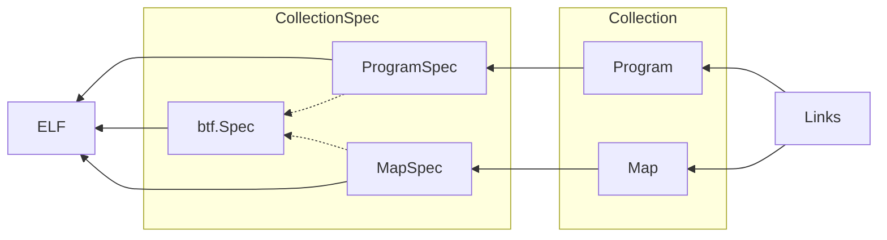

Architecture of the library
===

ELF
---

BPF is usually produced by using Clang to compile a subset of C. Clang outputs
an ELF file which contains program byte code (aka BPF), but also metadata for
maps used by the program. The metadata follows the conventions set by libbpf
shipped with the kernel. Certain ELF sections have special meaning
and contain structures defined by libbpf. Newer versions of clang emit
additional metadata in [BPF Type Format](#BTF).

The library aims to be compatible with libbpf so that moving from a C toolchain
to a Go one creates little friction. To that end, the [ELF reader](elf_reader.go)
is tested against the Linux selftests and avoids introducing custom behaviour
if possible.

The output of the ELF reader is a `CollectionSpec` which encodes
all of the information contained in the ELF in a form that is easy to work with
in Go. The returned `CollectionSpec` should be deterministic: reading the same ELF
file on different systems must produce the same output.
As a corollary, any changes that depend on the runtime environment like the
current kernel version must happen when creating [Objects](#Objects).

Specifications
---

`CollectionSpec` is a very simple container for `ProgramSpec`, `MapSpec` and
`btf.Spec`. Avoid adding functionality to it if possible.

`ProgramSpec` and `MapSpec` are blueprints for in-kernel
objects and contain everything necessary to execute the relevant `bpf(2)`
syscalls. They refer to `btf.Spec` for type information such as `Map` key and
value types.

The [asm](asm/) package provides an assembler that can be used to generate
`ProgramSpec` on the fly.

Objects
---

`Program` and `Map` are the result of loading specifications into the kernel.
Features that depend on knowledge of the current system (e.g kernel version)
are implemented at this point.

Sometimes loading a spec will fail because the kernel is too old, or a feature is not
enabled. There are multiple ways the library deals with that:

* Fallback: older kernels don't allow naming programs and maps. The library
  automatically detects support for names, and omits them during load if
  necessary. This works since name is primarily a debug aid.

* Sentinel error: sometimes it's possible to detect that a feature isn't available.
  In that case the library will return an error wrapping `ErrNotSupported`.
  This is also useful to skip tests that can't run on the current kernel.

Once program and map objects are loaded they expose the kernel's low-level API,
e.g. `NextKey`. Often this API is awkward to use in Go, so there are safer
wrappers on top of the low-level API, like `MapIterator`. The low-level API is
useful when our higher-level API doesn't support a particular use case.

Links
---

Programs can be attached to many different points in the kernel and newer BPF hooks
tend to use bpf_link to do so. Older hooks unfortunately use a combination of
syscalls, netlink messages, etc. Adding support for a new link type should not
pull in large dependencies like netlink, so XDP programs or tracepoints are
out of scope.

Each bpf_link_type has one corresponding Go type, e.g. `link.tracing` corresponds
to BPF_LINK_TRACING. In general, these types should be unexported as long as they
don't export methods outside of the Link interface. Each Go type may have multiple
exported constructors. For example `AttachTracing` and `AttachLSM` create a
tracing link, but are distinct functions since they may require different arguments.
