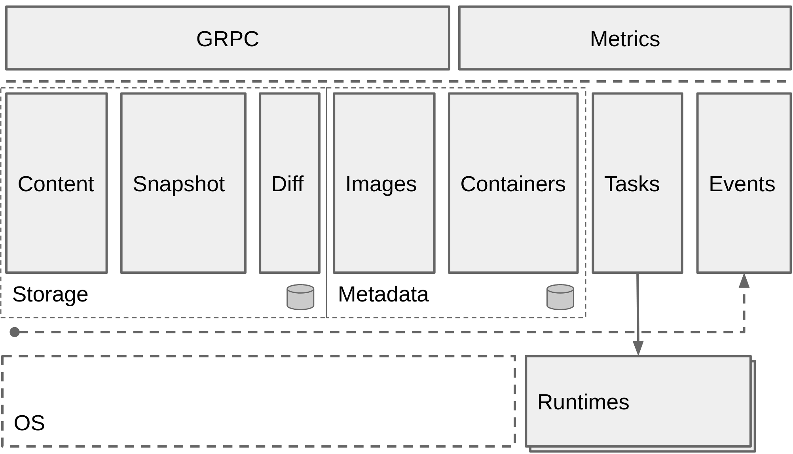

[](https://godoc.org/github.com/containerd/containerd)
[](https://travis-ci.org/containerd/containerd)
[](https://app.fossa.io/projects/git%2Bhttps%3A%2F%2Fgithub.com%2Fcontainerd%2Fcontainerd?ref=badge_shield)
[](https://goreportcard.com/report/github.com/containerd/containerd)

containerd is an industry-standard container runtime with an emphasis on simplicity, robustness and portability. It is available as a daemon for Linux and Windows, which can manage the complete container lifecycle of its host system: image transfer and storage, container execution and supervision, low-level storage and network attachments, etc.

containerd is designed to be embedded into a larger system, rather than being used directly by developers or end-users.



## Getting Started

If you are interested in trying out containerd please see our [Getting Started Guide](docs/getting-started.md).

## Features

### Client

containerd offers a full client package to help you integrate containerd into your platform.

```go

import "github.com/containerd/containerd"

func main() {
	client, err := containerd.New("/run/containerd/containerd.sock")
	defer client.Close()
}

```

### Namespaces

Namespaces allow multiple consumers to use the same containerd without conflicting with each other.  It has the benefit of sharing content but still having separation with containers and images.

To set a namespace for requests to the API:

```go
context    = context.Background()
// create a context for docker
docker = namespaces.WithNamespace(context, "docker")

containerd, err := client.NewContainer(docker, "id")
```

To set a default namespace on the client:

```go
client, err := containerd.New(address, containerd.WithDefaultNamespace("docker"))
```

### Distribution

```go
// pull an image
image, err := client.Pull(context, "docker.io/library/redis:latest")

// push an image
err := client.Push(context, "docker.io/library/redis:latest", image.Target())
```

### Containers

In containerd, a container is a metadata object.  Resources such as an OCI runtime specification, image, root filesystem, and other metadata can be attached to a container.

```go
redis, err := client.NewContainer(context, "redis-master")
defer redis.Delete(context)
```

### OCI Runtime Specification

containerd fully supports the OCI runtime specification for running containers.  We have built in functions to help you generate runtime specifications based on images as well as custom parameters.

You can specify options when creating a container about how to modify the specification.

```go
redis, err := client.NewContainer(context, "redis-master", containerd.WithNewSpec(containerd.WithImageConfig(image)))
```

### Root Filesystems

containerd allows you to use overlay or snapshot filesystems with your containers.  It comes with builtin support for overlayfs and btrfs.

```go
// pull an image and unpack it into the configured snapshotter
image, err := client.Pull(context, "docker.io/library/redis:latest", containerd.WithPullUnpack)

// allocate a new RW root filesystem for a container based on the image
redis, err := client.NewContainer(context, "redis-master",
	containerd.WithNewSnapshot("redis-rootfs", image),
	containerd.WithNewSpec(containerd.WithImageConfig(image)),

)

// use a readonly filesystem with multiple containers
for i := 0; i < 10; i++ {
	id := fmt.Sprintf("id-%s", i)
	container, err := client.NewContainer(ctx, id,
		containerd.WithNewSnapshotView(id, image),
		containerd.WithNewSpec(containerd.WithImageConfig(image)),
	)
}
```

### Tasks

Taking a container object and turning it into a runnable process on a system is done by creating a new `Task` from the container.  A task represents the runnable object within containerd.

```go
// create a new task
task, err := redis.NewTask(context, containerd.Stdio)
defer task.Delete(context)

// the task is now running and has a pid that can be use to setup networking
// or other runtime settings outside of containerd
pid := task.Pid()

// start the redis-server process inside the container
err := task.Start(context)

// wait for the task to exit and get the exit status
status, err := task.Wait(context)
```

### Checkpoint and Restore

If you have [criu](https://criu.org/Main_Page) installed on your machine you can checkpoint and restore containers and their tasks.  This allow you to clone and/or live migrate containers to other machines.

```go
// checkpoint the task then push it to a registry
checkpoint, err := task.Checkpoint(context, containerd.WithExit)

err := client.Push(context, "myregistry/checkpoints/redis:master", checkpoint)

// on a new machine pull the checkpoint and restore the redis container
image, err := client.Pull(context, "myregistry/checkpoints/redis:master")

checkpoint := image.Target()

redis, err = client.NewContainer(context, "redis-master", containerd.WithCheckpoint(checkpoint, "redis-rootfs"))
defer container.Delete(context)

task, err = redis.NewTask(context, containerd.Stdio, containerd.WithTaskCheckpoint(checkpoint))
defer task.Delete(context)

err := task.Start(context)
```

## Developer Quick-Start

To build the daemon and `ctr` simple test client, the following build system dependencies are required:

* Go 1.9.x or above
* Protoc 3.x compiler and headers (download at the [Google protobuf releases page](https://github.com/google/protobuf/releases))
* Btrfs headers and libraries for your distribution. Note that building the btrfs driver can be disabled via build tag removing this dependency.

For proper results, install the `protoc` release into `/usr/local` on your build system. For example, the following commands will download and install the 3.1.0 release for a 64-bit Linux host:

```
$ wget -c https://github.com/google/protobuf/releases/download/v3.1.0/protoc-3.1.0-linux-x86_64.zip
$ sudo unzip protoc-3.1.0-linux-x86_64.zip -d /usr/local
```

With the required dependencies installed, the `Makefile` target named **binaries** will compile the `ctr` and `containerd` binaries and place them in the `bin/` directory. Using `sudo make install` will place the binaries in `/usr/local/bin`. When making any changes to the gRPC API, `make generate` will use the installed `protoc` compiler to regenerate the API generated code packages.

> *Note*: A build tag is currently available to disable building the btrfs snapshot driver.
> Adding `BUILDTAGS=no_btrfs` to your environment before calling the **binaries**
> Makefile target will disable the btrfs driver within the containerd Go build.

Vendoring of external imports uses the [`vndr` tool](https://github.com/LK4D4/vndr) which uses a simple config file, `vendor.conf`, to provide the URL and version or hash details for each vendored import. After modifying `vendor.conf` run the `vndr` tool to update the `vendor/` directory contents. Combining the `vendor.conf` update with the changeset in `vendor/` after running `vndr` should become a single commit for a PR which relies on vendored updates.

Please refer to [RUNC.md](/RUNC.md) for the currently supported version of `runc` that is used by containerd.

### Releases and API Stability

Please see [RELEASES.md](RELEASES.md) for details on versioning and stability
of containerd components.

### Development reports.

Weekly summary on the progress and what is being worked on.
https://github.com/containerd/containerd/tree/master/reports

### Communication

For async communication and long running discussions please use issues and pull requests on the github repo.
This will be the best place to discuss design and implementation.

For sync communication we have a community slack with a #containerd channel that everyone is welcome to join and chat about development.

**Slack:** https://dockr.ly/community

### Reporting security issues

__If you are reporting a security issue, please reach out discreetly at security@containerd.io__.

## Licenses

The containerd codebase is released under the [Apache 2.0 license](LICENSE.code).
The README.md file, and files in the "docs" folder are licensed under the
Creative Commons Attribution 4.0 International License under the terms and
conditions set forth in the file "[LICENSE.docs](LICENSE.docs)". You may obtain a duplicate
copy of the same license, titled CC-BY-4.0, at http://creativecommons.org/licenses/by/4.0/.
