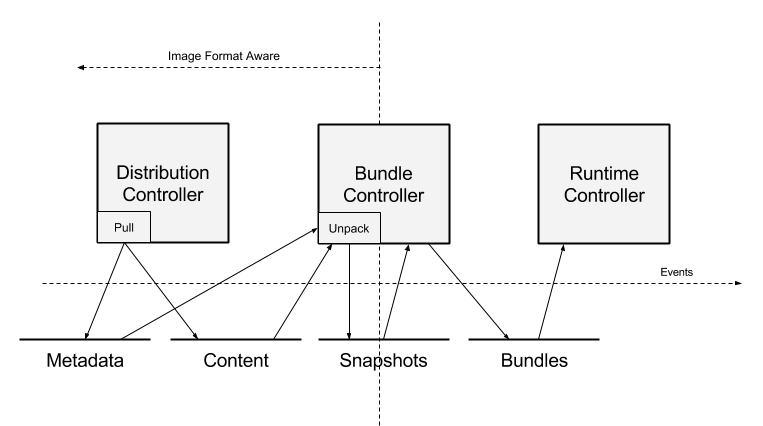

# Architecture

To ensure clean separation of concerns, we have organized the units of
containerd's behavior into _components_. _Components_ are roughly organized
into _subsystems_. _Components_ that bridge subsystems may be referred to as
_modules_. _Modules_ typically provide cross-cutting functionality, such as
persistent storage or event distribution. Understanding these _components_ and
their relationships is key to modifying and extending the system.

This document will cover very high-level interaction. For details on each
module, please see the relevant design document.

The main goal of this architecture is to coordinate the creation and execution
of _bundles_.  _Bundles_ contain configuration, metadata and root filesystem
data and are consumed by the _runtime_. A _bundle_ is the on-disk
representation of a runtime container. _Bundles_ are mutable and can be passed
to other systems for modification or packed up and distributed. In practice, it
is simply a directory on the filesystem. 

Note that while these architectural ideas are important to understand the
system, code layout may not reflect the exact architecture. These ideas should
be used as a guide for placing functionality and behavior and understanding the
thought behind the design.

## Subsystems

External users interact with services, made available via a GRPC API.

- __*Bundle*__: The bundle service allows the user to extract and pack bundles
  from disk images.
- __*Runtime*__: The runtime service supports the execution of _bundles_,
  including the creation of runtime containers.

Typically, each subsystem will have one or more related _controller_ components
that implement the behavior of the _subsystem_. The behavior of the _subsystem_
may be exported for access via corresponding _services_.

## Modules

In addition to the subsystems have, we have several components that may cross
subsystem boundaries, referenced to as components. We have the following
components:

- __*Executor*__: The executor implements the actual container runtime.
- __*Supervisor*__: The supervisor monitors and reports container state.
- __*Metadata*__: Stores metadata in a graph database. Use to store any
  persistent references to images and bundles. Data entered into the
  database will have schemas coordinated between components to provide access
  to arbitrary data. Other functionality includes hooks for garbage collection
  of on-disk resources.
- __*Content*__: Provides access to content addressable storage. All immutable
  content will be stored here, keyed by content hash.
- __*Snapshot*__: Manages filesystem snapshots for container images. This is
  analogous to the graphdriver in Docker today. Layers are unpacked into
  snapshots.
- __*Events*__: Supports the collection and consumption of events for providing
  consistent, event driven behavior and auditing. Events may be replayed to
  various _modules_
- __*Metrics*__: Each components will export several metrics, accessible via
  the metrics API. (We may want to promote this to a subsystem.

## Client-side components

Some components are implemented on the client side for flexibility:

- __*Distribution*__: Functions for pulling and pushing images

## Data Flow

As discussed above, the concept of a _bundle_ is central to containerd. Below
is a diagram illustrating the data flow for bundle creation.

Let's take pulling an image as a demonstrated example:

1. Instruct the Distribution layer to pull a particular image. The distribution
   layer places the image content into the _content store_. The image name and
   root manifest pointers are registered with the metadata store.
2. Once the image is pulled, the user can instruct the bundle controller to
   unpack the image into a bundle. Consuming from the content store, _layers_
   from the image are unpacked into the _snapshot_ component.
3. When the snapshot for the rootfs of a container is ready, the _bundle
   controller_ can use the image manifest and config to prepare the execution
   configuration. Part of this is entering mounts into the execution config
   from the _snapshot_ module.
4. The prepared bundle is then passed off to the _runtime_ subsystem for
   execution. It reads the bundle configuration to create a running container.

