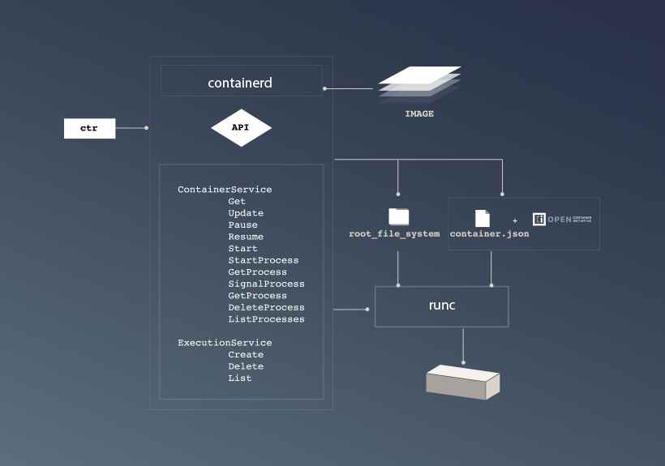
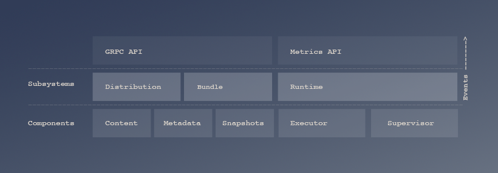
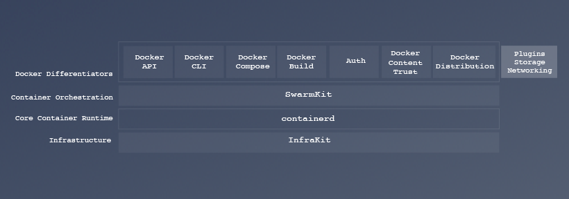
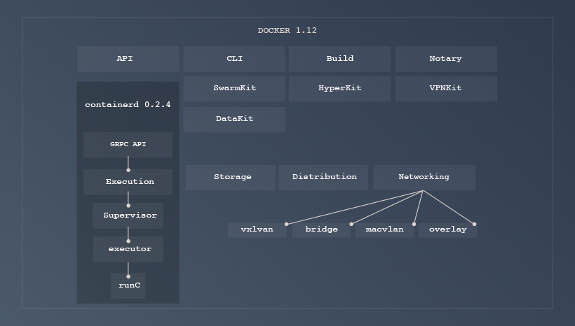
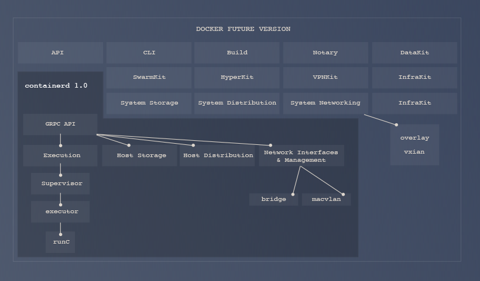
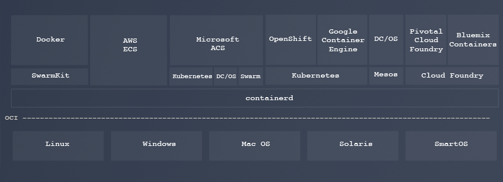

## News

* [Sign up for containerd Summit at DockerCon in April](dockercon-summit)
* [March 15th: Docker to donate containerd to the Cloud Native Computing Foundation](https://blog.docker.com/2017/03/docker-donates-containerd-to-cncf/)
* [February 28th: containerd Summit recap](https://blog.docker.com/2017/02/containerd-summit-recap-slides-videos-meeting-notes/)
* [January 4th: containerd Livestream recap](https://blog.docker.com/2017/01/containerd-livestream-recap)

## About containerd

containerd is an industry-standard core container runtime with an emphasis on simplicity, robustness and portability. It is available as a daemon for Linux and Windows, which can manage the complete container lifecycle of its host system: image transfer and storage, container execution and supervision, low-level storage and network attachments, etc..

containerd is designed to be embedded into a larger system, rather than being used directly by developers or end-users.

containerd includes a daemon exposing gRPC API over a local UNIX socket. The API is a low-level one designed for higher layers to wrap and extend. It also includes a barebone CLI (`ctr`) designed specifically for development and debugging purpose. It uses [runC](https://github.com/opencontainers/runc) to run containers according to the [OCI specification](https://www.opencontainers.org/about). The code can be found on [GitHub](https://github.com/containerd/containerd), and here are the [contribution guidelines](https://github.com/containerd/containerd/blob/master/CONTRIBUTING.md).

containerd is based on the Docker Engine’s core container runtime to benefit from its maturity and existing contributors.

## Features and roadmap

* OCI Image Spec support
* OCI Runtime Spec support (aka runC)
* Image push and pull support
* Container runtime and lifecycle support
* Network primitives for creation, modification, and deletion of interfaces
* Management of network namespaces containers to join existing namespaces
* Multi-tenant supported with CAS storage for global images

containerd, currently in [version 0.2.4](https://github.com/containerd/containerd/releases/tag/v0.2.4), is a daemon born from extracting the container execution subset of the Docker Engine, and is [used internally by Docker since the 1.11 release](https://blog.docker.com/2016/04/docker-engine-1-11-runc/). containerd will graduate to version 1.0 once its feature scope matches the requirements above, from which it will commit to API stability as well as committing to a 1-year LTS release. Docker Engine commits to upgrading to containerd 1.0 as part of its regular release cycle.

[containerd roadmap](https://github.com/containerd/containerd/blob/master/ROADMAP.md) to implement these features is described in the containerd Github repository.

## Architecture

Containerd [architecture](https://github.com/containerd/containerd/blob/master/design/architecture.md) and [API](https://github.com/containerd/containerd/tree/master/api/) are described in the Github repository.

## Principles and Releases

Having a clearly defined scope of a project is important for ensuring consistency and focus.
These following criteria will be used when reviewing pull requests, features, and changes for the project before being accepted.

### Components

Components should not have tight dependencies on each other so that they are unable to be used independently.
The APIs for images and containers should be designed in a way that when used together the components have a natural flow but still be useful independently.

An example for this design can be seen with the overlay filesystems and the container execution layer.
The execution layer and overlay filesystems can be used independently but if you were to use both, they share a common `Mount` struct that the filesystems produce and the execution layer consumes.

### Primitives

containerd should expose primitives to solve problems instead of building high level abstractions in the API.
A common example of this is how build would be implemented.
Instead of having a build API in containerd we should expose the lower level primitives that allow things required in build to work.
Breaking up the filesystem APIs to allow snapshots, copy functionality, and mounts allow people implementing build at the higher levels more flexibility.

### Extensibility and Defaults

For the various components in containerd there should be defined extension points where implementations can be swapped for alternatives.
The best example of this is that containerd will use `runc` from OCI as the default runtime in the execution layer but other runtimes conforming to the OCI Runtime specification they can be easily added to containerd.

containerd will come with a default implementation for the various components.
These defaults will be chosen by the maintainers of the project and should not change unless better tech for that component comes out.
Additional implementations will not be accepted into the core repository and should be developed in a separate repository not maintained by the containerd maintainers.

### Releases

containerd will be released with a 1.0 when feature complete with Linux and Windows parity and this version will be supported for 1 year with security and bug fixes applied and released.

The upgrade path for containerd is that the 0.0.x patch releases are always backward compatible with its major and minor version.
Minor (0.x.0) version will always be compatible with the previous minor release. i.e. 1.2.0 is backwards compatible with 1.1.0 and 1.1.0 is compatible with 1.0.0.
There is no compatibility guarantees with upgrades from two minor relases.  i.e. 1.0.0 to 1.2.0.

There are no backwards compatibility guarantees with upgrades to major versions.  i.e 1.0.0 to 2.0.0.
Each major version will be supported for 1 year with bug fixes and security patches.

## FAQ

1. What is the relationship between containerd and Docker?

Docker is a complete platform and programming environment for containerized applications. containerd is one of dozens of specialized components integrated into Docker. Developers and IT professionals looking to build, ship and run containerized applications should continue to use Docker. Operators and integrators looking for specialized components to swap into their platform should consider containerd.

containerd 0.2.4 used in Docker 1.12 covers only container execution and process management.

containerd's roadmap is to refactor the Docker Engine codebase to extract more of its logic for distribution, networking and storage on a single host into a reusable component that Docker will use, and that can be used by other container orchestration projects or hosted container services.

2. What is the relationship between containerd, OCI and runc?

Docker [donated the OCI specification to the Linux Foundation in 2015](https://blog.docker.com/2015/06/open-container-project-foundation/), along with a reference implementation called `runc`. containerd integrates [OCI](https://www.opencontainers.org/)/[runc](https://runc.io/) into a feature-complete, production-ready core container runtime. runc is a component of containerd, the executor for containers. containerd has a wider scope than just executing containers: downloading container images, managing storage and network interfaces, calling runc with the right parameters to run containers. containerd fully leverages the Open Container Initiative’s (OCI) runtime, image format specifications and OCI reference implementation (runc) and will pursue OCI certification when it is available. Because of its massive adoption, containerd is the industry standard for implementing OCI. 

3. What is the relationship between containerd and container orchestration systems like Kubernetes and Mesos?

Kubernetes today uses Docker directly. In a future version Kubernetes can implement container support in the Kubelet by implementing it's [Container Runtime Interface](https://github.com/kubernetes/kubernetes/blob/release-1.5/docs/devel/container-runtime-interface.md) using containerd. Mesos and other orchestration engines can leverage containerd for core container runtime functionality as well.

4. What is the relationship between containerd and cloud managed container services?

See answer above: cloud managed container services can leverage containerd instead of Docker in order to provide container functionalities to their users.

## CNCF

We are a Cloud Native Computing Foundation member project.
