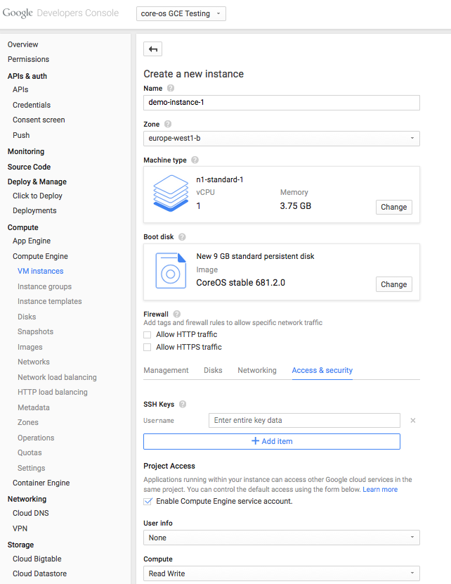
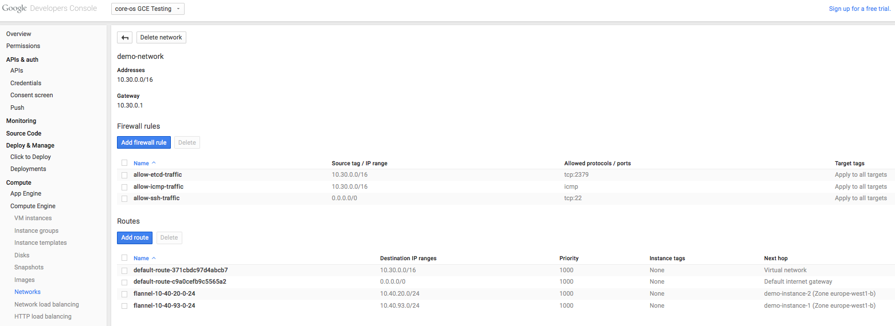

# GCE Backend for Flannel

When running on Google Compute Engine, we recommend using the GCE backend which, instead of using encapsulation, manipulates IP routes to achieve maximum performance. Because of this, a separate flannel interface is not created.

From the Developers Console, we start by creating a new network.

Configure the network name and address range. Then add firewall rules to allow etcd traffic (tcp/2379), SSH, and ICMP. 
That's it for the network configuration.
Now it’s time to create an instance.
Let's call it `demo-instance-1`.
Under the "Management, disk, networking, access & security options" make the following changes:

- Select the "Network" to be our newly created network
- Enable IP forwarding
- Under "Access and Security" set the compute permissions to "Read Write" and remember to add your SSH key

<br/>
<div class="row">
  <div class="col-lg-6 col-md-6 col-sm-6 col-xs-12 co-m-screenshot">
    <a href="img/gce-instance.png">
      
    </a>
    <div class="co-m-screenshot-caption">Booting a new GCE instance</div>
  </div>
  <div class="col-lg-6 col-md-6 col-sm-6 col-xs-12 co-m-screenshot">
    <a href="img/gce-instance-and-security.png">
      
    </a>
    <div class="co-m-screenshot-caption">Security settings for a new instance</div>
  </div>
</div>

With the permissions set, we can launch the instance! 

The only remaining steps now are to start etcd, publish the network configuration and lastly, run the flannel daemon. 
SSH into `demo-instance-1` and execute the following steps:

- Start etcd:

```
$ etcd2 -advertise-client-urls http://$INTERNAL_IP:2379 -listen-client-urls http://0.0.0.0:2379
```

- Publish configuration in etcd (ensure that the network range does not overlap with the one configured for the GCE network)

```
$ etcdctl set /coreos.com/network/config '{"Network":"10.40.0.0/16", "Backend": {"Type": "gce"}}'
```

- Fetch the 0.5 release using wget from [here](https://github.com/coreos/flannel/releases/download/v0.5.0/flannel-0.5.0-linux-amd64.tar.gz)
- Run flannel daemon:

```
$ sudo ./flanneld --etcd-endpoints=http://127.0.0.1:2379
```

Now make a clone of `demo-instance-1` and SSH into it to run the these steps:

- Fetch the 0.5 release as before.
- Run flannel with the `--etcd-endpoints` flag set to the *internal* IP of the instance running etcd

Check that the subnet lease acquired by each of the hosts has been added!

<br/>
<div class="row">
  <div class="col-lg-10 col-lg-offset-1 col-md-10 col-md-offset-1 col-sm-12 col-xs-12 co-m-screenshot">
    <a href="img/gce-routes.png" class="co-m-screenshot">
      
    </a>
  </div>
</div>
<div class="caption">GCE Routes</div>

### Limitations

It’s important to note that GCE currently [limits](https://cloud.google.com/compute/docs/resource-quotas) the number of routes per *project* to 100. If you require more routes, request a quota increase or simply switch to the VXLAN backend.
