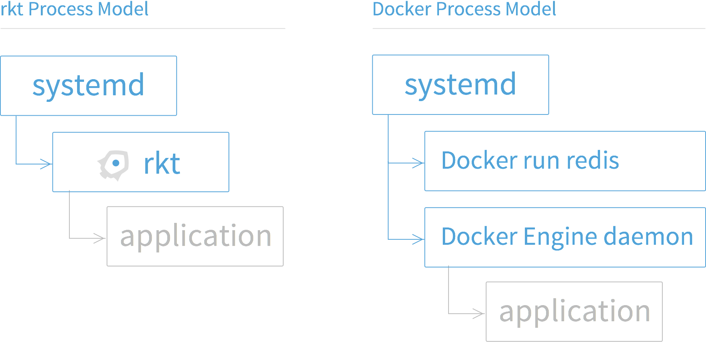
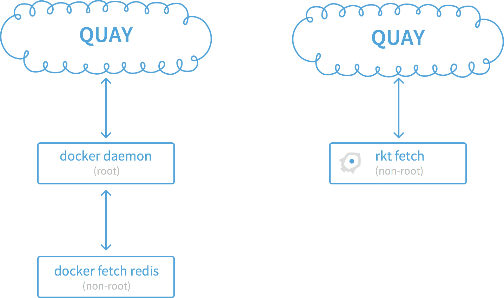

# rkt vs other projects

This document describes how rkt compares to various other projects in the container ecosystem.

* [rkt vs Docker](#rkt-vs-docker)
  * [Process Model](#process-model)
  * [Privilege Separation](#privilege-separation)
* [rkt vs runC](#rkt-vs-runc)
* [rkt vs containerd](#rkt-vs-containerd)
* [rkt vs LXC/LXD](#rkt-vs-lxclxd)
* [rkt vs OpenVZ](#rkt-vs-openvz)
* [rkt vs systemd-nspawn](#rkt-vs-systemd-nspawn)
* [rkt vs machinectl](#rkt-vs-machinectl)
* [rkt vs qemu-kvm, lkvm](#rkt-vs-qemu-kvm-lkvm)

## rkt vs Docker

The Docker Engine is an application container runtime implemented as a central API daemon.
Docker can resolve a "[Docker Image][docker-image-spec]" name, such as `quay.io/coreos/etcd`, and download, execute, and monitor the application container.
Functionally, this is all similar to rkt; however, along with "Docker Images", rkt can also download and run "App Container Images" (ACIs) specified by the [App Container Specification][appc-spec] (appc).

Besides also supporting ACIs, rkt has a substantially different architecture that is designed with composability and security in mind.

#### Process Model

Prior to Docker version 1.11, the Docker Engine daemon downloaded container images, launched container processes, exposed a remote API, and acted as a log collection daemon, all in a centralized process running as root.

While such a centralized architecture is convenient for deployment, it does not follow best practices for Unix process and privilege separation; further, it makes Docker difficult to properly integrate with Linux init systems such as upstart and systemd.

Since version 1.11, the Docker daemon no longer handles the execution of containers itself.
Instead, this is now handled by [containerd][containerd].
More precisely, the Docker daemon prepares the image as an [Open Container Image][oci] (OCI) bundle and makes an API call to containerd to start the OCI bundle.
containerd then starts the container using [runC][runc-github].

Since running a Docker container from the command line (i.e. using `docker run`) just talks to the Docker daemon API, which is in turn directly or indirectly — via containerd — responsible for creating the container, init systems are unable to directly track the life of the actual container process.

rkt has no centralized "init" daemon, instead launching containers directly from client commands, making it compatible with init systems such as systemd, upstart, and others.

#### Privilege Separation

rkt uses standard Unix group permissions to allow privilege separation between different operations.
Once the rkt data directory is correctly set up, container image downloads and signature verification can run as a non-privileged user.

## rkt vs runC

[runC][runc-github] is a low-level container runtime and an implementation of the [Open Container Initiative specification][oci-spec-github].
runC exposes and expects a user to understand low-level details of the host operating system and configuration.
It requires the user to separately download or cryptographically verify container images, and for "higher level tools" to prepare the container filesystem.
runC does not have a centralized daemon, and, given a properly configured "OCI bundle", can be integrated with init systems such as upstart and systemd.

rkt includes the same functionality as runC but does not expect a user to understand low-level details of the operating system to use, and can be invoked as simply as `rkt run coreos.com/etcd,version=v2.2.0`.
It can download both "[Docker Images][docker-image-spec]" and "[App Container Images][appc-spec]".
As rkt does not have a centralized daemon it can also be easily integrated with init systems such as upstart and systemd.

## rkt vs containerd

[containerd][containerd] is a daemon to control [runC][runc-github].
It has a command-line tool called `ctr` which is used to interact with the containerd daemon.
This makes the containerd process model similar to that of the Docker process model, illustrated above.

Unlike the Docker daemon it has a reduced feature set; not supporting image download, for example.

rkt has no centralized daemon to manage containers, instead launching containers directly from client commands, making it compatible with init systems such as systemd, upstart, and others.

## rkt vs LXC/LXD

LXC is a system container runtime designed to execute "full system containers", which generally consist of a full operating system image.
An LXC process, in most common use cases, will boot a full Linux distribution such as Debian, Fedora, Arch, etc, and a user will interact with it similarly to how they would with a Virtual Machine image.

LXC may also be used to run (but not download) application containers, but this use requires more understanding of low-level operating system details and is a less common practice.
LXC can download "full system container" images from various public mirrors and cryptographically verify them.
LXC does not have a central daemon and can integrate with init systems such as upstart and systemd.

LXD is similar to LXC but is a REST API on top of liblxc which forks a monitor and container process.
This ensures the LXD daemon is not a central point of failure and containers continue running in case of LXD daemon failure.
All other details are nearly identical to LXC.

rkt can download, cryptographically verify, and run application container images.
It is not designed to run "full system containers" but instead individual applications such as web apps, databases, or caches.
As rkt does not have a centralized daemon it can be integrated with init systems such as upstart and systemd.

## rkt vs OpenVZ

OpenVZ is a system container runtime designed to execute "full system containers" which are generally a full system image.
An OpenVZ process, in most common use cases, will boot a full Linux Distro such as Debian, Fedora, Arch, etc and  a user will interact with it similarly to a Virtual Machine image.
OpenVZ can download "full system container" images from various public mirrors and cryptographically verify them.
OpenVZ does not have a central daemon and can integrate with init systems such as upstart and systemd.

rkt can download, cryptographically verify, and run application container images.
It is not designed to run "full system containers" but instead individual applications such as web apps, databases, or caches.
As rkt does not have a centralized daemon it can be integrated with init systems such as upstart and systemd.

## rkt vs systemd-nspawn

systemd-nspawn is a container runtime designed to execute a process inside of a Linux container.
systemd-nspawn gets its name from "namespace spawn", which means it only handles process isolation and does not do resource isolation like memory, CPU, etc.
systemd-nspawn can run an application container or system container but does not, by itself, download or verify images.
systemd-nspawn does not have a centralized daemon and can be integrated with init systems such as upstart and systemd.

rkt can download, cryptographically verify, and run application container images.
It is not designed to run "full system containers", but instead individual applications such as web apps, databases, or caches.
As rkt does not have a centralized daemon it can be integrated with init systems such as upstart and systemd.
By default rkt uses systemd-nspawn to configure the namespaces for an application container.

## rkt vs machinectl

machinectl is a system manager that can be used to query and control the state of registered systems on a systemd host.
These systems may be registered Virtual Machines, systemd-nspawn containers, or other runtimes that register with the systemd registration manager, systemd-machined.
Among many other things, machinectl can download, cryptographically verify, extract and trigger to run a systemd-nspawn container off the extracted image content.
By default these images are expected to be "full system containers", as systemd-nspawn is passed the “--boot” argument.

On systemd hosts, rkt will integrate with systemd-machined in much the same way that machinectl containers will: any pods created by rkt will be registered as machines on the host and can be interacted with using machinectl commands.
However, in being more oriented towards applications, rkt abstracts the pod lifecycle away from the user.
rkt also provides a more configurable and advanced workflow around discovering, downloading and verifying images, as well as supporting more image types.
Unlike machinectl, rkt execs systemd-nspawn directly instead of creating a systemd service, allowing it to integrate cleanly with any supervisor system.
Furthermore, in addition to namespace isolation, rkt can set up various other kinds of isolation (e.g. resources) defined in the appc specification.

## rkt vs qemu-kvm, lkvm

qemu-kvm and lkvm are userspace tools that execute a full system image inside of a Virtual Machine using the [Linux KVM infrastructure][kvm-wiki].
A system image will commonly include a boot loader, kernel, root filesystem and be pre-installed with applications to run on boot.
Most commonly qemu-kvm is used for IaaS systems such as OpenStack, Eucalyptus, etc.
The Linux KVM infrastructure is trusted for running multi-tenanted virtual machine infrastructures and is generally accepted as being secure enough to run untrusted system images.
qemu-kvm and lkvm do not have a centralized daemon and can be integrated with init systems such as upstart and systemd.

rkt can download, cryptographically verify, and run application container images.
It is not designed to run "full system images" but instead individual applications such as web apps, databases, or caches.
As rkt does not have a centralized daemon it can be integrated with init systems such as upstart and systemd.
rkt can optionally use lkvm or qemu-kvm as an additional security measure over a Linux container, at a slight cost to performance and flexibility; this feature can be configured using the [kvm (aka Clear Containers) stage1][kvm-stage1].

[appc-spec]: https://github.com/appc/spec
[containerd]: https://containerd.tools
[docker-image-spec]: https://github.com/docker/docker/blob/master/image/spec/v1.md
[kvm-wiki]: https://en.wikipedia.org/wiki/Kernel-based_Virtual_Machine
[kvm-stage1]: running-kvm-stage1.md
[oci]: https://www.opencontainers.org/
[oci-spec-github]: https://github.com/opencontainers/specs
[runc-github]: https://github.com/opencontainers/runc
