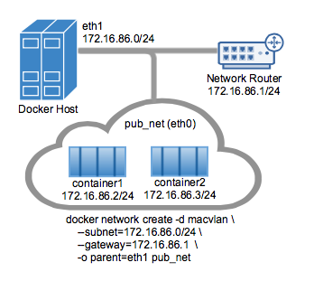
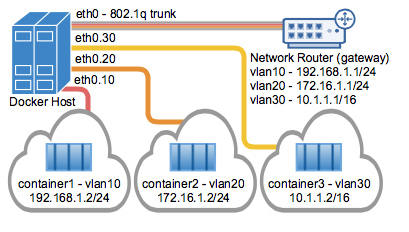
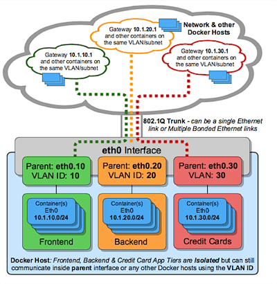

# Macvlan Driver

### Overview

The Macvlan driver provides operators the ability to integrate Docker networking in a simple and lightweight fashion into the underlying network. Macvlan is supported by the Linux kernel and is a well known Linux network type. The Macvlan built-in driver does not require any port mapping and supports VLAN trunking (Virtual Local Area Network). VLANs are a traditional method of network virtualization and layer 2 datapath isolation that is prevalent in some form or fashion in most data centers.

The Linux implementation is considered lightweight because it eliminates the need for using a Linux bridge for isolating containers on the Docker host. The VLAN driver requires full access to the underlying host making it suitable for Enterprise data centers that have administrative access to the host.

Instead of attaching container network interfaces to a Docker host Linux bridge for a network, the driver simply connects the container interface to the Docker Host Ethernet interface (or sub-interface). Each network is attached to a unique parent interface. Containers in a network share a common broadcast domain and intra-network connectivity is permitted. Two separate networks will each have a unique parent interface and that parent is what enforces datapath isolation between two networks. In order for inter-network communications to occur, an IP router, external to the Docker host, is required to route between the two networks by hair-pining into the physical network and then back to the Docker host. While hairpinning traffic can be less efficient then east/west traffic staying local to the host, there is often more complexity associated with disaggregating services to the host. It can be practical for some users to leverage existing network services, such firewalls and load balancers that already exist in a data center architecture.

When using traditional Linux bridges there are two common techniques to get traffic out of a container and into the physical network and vice versa. The first method to connect containers to the underlying network is to use Iptable rules which perform a NAT translation from a bridge that represents the Docker network to the physical Ethernet connection such as `eth0`. The upside of Iptables using the Docker built-in bridge driver is that the NIC does not have to be in promiscuous mode. The second bridge driver method is to move a host's external Ethernet connection into the bridge. Moving the host Ethernet connection can at times be unforgiving. Common mistakes such as cutting oneself off from the host, or worse, creating bridging loops that can cripple a VLAN throughout a data center can open a network design up to potential risks as the infrastructure grows.

Connecting containers without any NATing is where the VLAN drivers accel. Rather than having to manage a bridge for each Docker network containers are connected directly to a `parent` interface such as `eth0` that attaches the container to the same broadcast domain as the parent interface. A simple example is if a host's `eth0` is on the network `192.168.1.0/24` with a gateway of `192.168.1.1` then a Macvlan Docker network can start containers on the addresses `192.168.1.2 - 192.168.1.254`. Containers use the same network as the parent `-o parent` that is specified in the `docker network create` command.

There are positive performance implication as a result of bypassing the Linux bridge, along with the simplicity of less moving parts, which is also attractive. Macvlan containers are easy to troubleshoot. The actual MAC and IP address of the container is bridged into the upstream network making a problematic application easy for operators to trace from the network. Existing underlay network management and monitoring tools remain relevant.

### Pre-Requisites

- The examples on this page are all single host and require Docker v1.12 or greater running on Linux.

- Any examples using a sub-interface like `eth0.10` can be replaced with `eth0` or any other valid parent interface on the Docker host. Sub-interfaces with a `.` are dynamically created. The parent `-o parent` interface parameter can also be left out of the `docker network create` all together and the driver will create a `dummy` Linux type interface that will enable local host connectivity to perform the examples.

- Kernel requirements:

 - To check your current kernel version, use `uname -r` to display your kernel version.
 - Macvlan Linux kernel v3.9–3.19 and 4.0+.

### MacVlan Bridge Mode Example Usage

- Macvlan driver networks are attached to a parent Docker host interface. Examples are a physical interface such as `eth0`, a sub-interface for 802.1q VLAN tagging like `eth0.10` (`.10` representing VLAN `10`) or even bonded `bond0` host adapters which bundle two Ethernet interfaces into a single logical interface and provide diversity in the server connection.

- The specified gateway is external to the host that is expected to be provided by the network infrastructure. If a gateway is not specified using the `--gateway` parameter, then Libnetwork will infer the first usable address of a subnet. For example, if a network's subnet is `--subnet 10.1.100.0/24` and no gateway is specified, Libnetwork will assign a gateway of `10.1.100.1` to the container. A second example would be a subnet of `--subnet 10.1.100.128/25` would receive a gateway of `10.1.100.129`.

- Containers on separate networks cannot reach one another without an external process routing between the two networks/subnets.

- Each Macvlan Bridge mode Docker network is isolated from one another and there can be only one network attached to a parent interface at a time. There is a theoretical limit of 4,094 sub-interfaces per host adapter that a Docker network could be attached to.

- The driver limits one network per parent interface. The driver does however accommodate secondary subnets to be allocated in a single Docker network for a multi-subnet requirement. The upstream router is responsible for proxy-arping between the two subnets.

- Any Macvlan container sharing the same subnet can communicate via IP to any other container in the same subnet without a gateway. It is important to note, that the parent will go into promiscuous mode when a container is attached to the parent since each container has a unique MAC address. Alternatively, Ipvlan which is currently an experimental driver uses the same MAC address as the parent interface and thus precluding the need for the parent being promiscuous.

In the following example, `eth0` on the docker host has an IP on the `172.16.86.0/24` network and a default gateway of `172.16.86.1`. The gateway is an external router with an address of `172.16.86.1`. An IP address is not required on the Docker host interface `eth0` in `bridge` mode, it merely needs to be on the proper upstream network to get forwarded by a network switch or network router.



**Note** The Docker network subnet specified needs to match the network that parent interface of the Docker host for external communications. For example, use the same subnet and gateway of the Docker host ethernet interface specified by the `-o parent=` option. The parent interface is not required to have a IP address assigned to it, since this is simply L2 flooding and learning.

- The parent interface used in this example is `eth0` and it is on the subnet `172.16.86.0/24`. The containers in the `docker network` will also need to be on this same subnet as the parent `-o parent=`. The gateway is an external router on the network.

- Libnetwork driver types are specified with the `-d <driver_name>` option. In this case `-d macvlan`

- The parent interface `-o parent=eth0` is configured as followed:

```
ip addr show eth0
3: eth0: <BROADCAST,MULTICAST,UP,LOWER_UP> mtu 1500 qdisc pfifo_fast state UP group default qlen 1000
    inet 172.16.86.250/24 brd 172.16.86.255 scope global eth0
```

Create the macvlan network and run a couple of containers attached to it:

```
# Macvlan  (-o macvlan_mode= Defaults to Bridge mode if not specified)
docker network create -d macvlan \
    --subnet=172.16.86.0/24 \
    --gateway=172.16.86.1  \
    -o parent=eth0 pub_net

# Run a container on the new network specifying the --ip address.
docker  run --net=pub_net --ip=172.16.86.10 -itd alpine /bin/sh

# Start a second container and ping the first
docker  run --net=pub_net -it --rm alpine /bin/sh
ping -c 4 172.16.86.10

```

 Take a look at the containers ip and routing table:

```

ip a show eth0
    eth0@if3: <BROADCAST,MULTICAST,UP,LOWER_UP,M-DOWN> mtu 1500 qdisc noqueue state UNKNOWN
    link/ether 46:b2:6b:26:2f:69 brd ff:ff:ff:ff:ff:ff
    inet 172.16.86.2/24 scope global eth0

ip route
    default via 172.16.86.1 dev eth0
    172.16.86.0/24 dev eth0  src 172.16.86.2

# NOTE: the containers can NOT ping the underlying host interfaces as
# they are intentionally filtered by Linux for additional isolation.
# In this case the containers cannot ping the -o parent=172.16.86.250
```


Users can explicitly specify the `bridge` mode option `-o macvlan_mode=bridge` or leave the mode option out since the most common mode of `bridge` is the driver default.

While the `eth0` interface does not need to have an IP address, it is not uncommon to have an IP address on the interface. Addresses can be excluded from getting an address from the default built in IPAM by using the `--aux-address=x.x.x.x` argument. This will blacklist the specified address from being handed out to containers from the built-in Libnetwork IPAM.

- The following is the same network example as above, but blacklisting the `-o parent=eth0` address from being handed out to a container.

```
docker network create -d macvlan \
    --subnet=172.16.86.0/24 \
    --gateway=172.16.86.1  \
    --aux-address="exclude_host=172.16.86.250" \
    -o parent=eth0 pub_net
```

Another option for specifying what subpool or range of usable addresses is used by the default Docker IPAM driver is to use the argument `--ip-range=`. This instructs the driver to allocate container addresses from the specific range, rather then the broader range from the `--subnet=` argument.

- The network create in the following example, allocates addresses beginning at `192.168.32.128` and increments n+1 upwards from there.

```
docker network create -d macvlan  \
    --subnet=192.168.32.0/24  \
    --ip-range=192.168.32.128/25 \
    --gateway=192.168.32.254  \
    -o parent=eth0 macnet32

# Start a container and verify the address is 192.168.32.128
docker run --net=macnet32 -it --rm alpine /bin/sh
```

The network can then be deleted with:

```
docker network rm <network_name or id>
```

- **Note:** Linux Macvlan interface types are not able to ping or communicate with the default namespace IP address. For example, if you create a container and try to ping the Docker host's `eth0` it will **not** work. That traffic is explicitly filtered by the kernel to offer additional provider isolation and security. This is a common gotcha when a user first uses those Linux interface types since it is natural to ping local addresses when testing.

For more on Docker networking commands see: [Working with Docker network commands](https://docs.docker.com/engine/userguide/networking/work-with-networks/)

### Macvlan 802.1q Trunk Bridge Mode Example Usage

VLANs have long been a primary means of virtualizing data center networks and are still in virtually all existing networks today. VLANs work by tagging a Layer-2 isolation domain with a 12-bit identifier ranging from 1-4094. The VLAN tag is inserted into a packet header that enables a logical grouping of a single subnet or multiple subnets of IPv4 and/or IPv6. It is very common for network operators to separate traffic using VLANs based on a subnet(s) function or security profile such as `web`, `db` or any other isolation requirements.

It is very common to have a compute host requirement of running multiple virtual networks concurrently on a host. Linux networking has long supported VLAN tagging, also known by its standard 802.1Q, for maintaining datapath isolation between networks. The Ethernet link connected to a Docker host can be configured to support the 802.1q VLAN IDs by creating Linux sub-interfaces, each sub-interface being allocated a unique VLAN ID.



Trunking 802.1q to a Linux host is notoriously painful for operations. It requires configuration file changes in order to be persistent through a reboot. If a bridge is involved, a physical NIC needs to be moved into the bridge and the bridge then gets the IP address. This has lead to many a stranded servers since the risk of cutting off access or misconfiguration is relatively high.

Like all of the Docker network drivers, the overarching goal is to alleviate the operational pains of managing network resources. To that end, when a network receives a sub-interface as the parent that does not exist, the drivers create the VLAN tagged interfaces while creating the network. If the sub-interface already exists it is simply used as is.

In the case of a host reboot, instead of needing to modify often complex network configuration files the driver will recreate all network links when the Docker daemon restarts. The driver tracks if it created the VLAN tagged sub-interface originally with the network create and will **only** recreate the sub-interface after a restart if it created the link in the first place.

The same holds true if the network is deleted `docker network rm`. If driver created the sub-interface with `docker network create` it will remove the sub-interface link for the operator.

If the user doesn't want Docker to create and delete the `-o parent` sub-interface, then you simply pass an interface that already exists as the parent link. Parent interfaces such as `eth0` are not deleted, only interfaces that are slave links.

For the driver to add/delete the vlan sub-interfaces the format needs to be `-o parent interface_name.vlan_tag`.

For example: `-o parent eth0.50` denotes a parent interface of `eth0` with a slave of `eth0.50` tagged with vlan id `50`. The equivalent `ip link` command would be `ip link add link eth0 name eth0.50 type vlan id 50`.

Replace the `macvlan` with `ipvlan` in the `-d` driver argument to create macvlan 802.1q trunks.

**Vlan ID 50**

In the next example, the network is tagged and isolated by the Docker host. A parent of `eth0.50` will tag the Ethernet traffic with the vlan id `50` specified by the parent nomenclature `-o parent=eth0.50`. Other naming formats can be used, but the links need to be added and deleted manually using `ip link` or Linux configuration files. As long as the `-o parent` exists, anything can be used if compliant with Linux netlink.

```
# now add networks and hosts as you would normally by attaching to the master (sub)interface that is tagged
docker network create -d macvlan \
    --subnet=192.168.50.0/24 \
    --gateway=192.168.50.1 \
    -o parent=eth0.50 macvlan50

# In two separate terminals, start a Docker container and the containers can now ping one another.
docker run --net=macvlan50 -it --name macvlan_test5 --rm alpine /bin/sh
docker run --net=macvlan50 -it --name macvlan_test6 --rm alpine /bin/sh
```

**Vlan ID 60**

In the second network, tagged and isolated by the Docker host, `eth0.60` is the parent interface tagged with vlan id `60` specified with `-o parent=eth0.60`. The `macvlan_mode=` defaults to `macvlan_mode=bridge`. It can also be explicitly set with the same result, as shown in the next example.

```
# now add networks and hosts as you would normally by attaching to the master (sub)interface that is tagged.
docker network create -d macvlan \
    --subnet=192.168.60.0/24 \
    --gateway=192.168.60.1 \
    -o parent=eth0.60 -o \
    -o macvlan_mode=bridge macvlan60

# In two separate terminals, start a Docker container and the containers can now ping one another.
docker run --net=macvlan60 -it --name macvlan_test7 --rm alpine /bin/sh
docker run --net=macvlan60 -it --name macvlan_test8 --rm alpine /bin/sh
```

**Example:** Multi-Subnet Macvlan 802.1q Trunking

The same as the example before except there is an additional subnet bound to the network that the user can choose to provision containers on. In MacVlan/Bridge mode, containers can only ping one another if they are on the same subnet/broadcast domain unless there is an external router that routes the traffic (answers ARP etc) between the two subnets. Multiple subnets assigned to a network require a gateway external to the host that falls within the subnet range to hairpin the traffic back to the host.


```
docker network create -d macvlan \
    --subnet=10.1.20.0/24 --subnet=10.1.10.0/24 \
    --gateway=10.1.20.1 --gateway=10.1.10.1 \
    -o parent=eth0.101 mcv101

# View Links after to network create `ip link`
$ ip link

# Test 10.1.20.10.0/24 connectivity
docker run --net=mcv101 --ip=10.1.20.9 -itd alpine /bin/sh
docker run --net=mcv101 --ip=10.1.20.10 -it --rm alpine ping -c 4 10.1.20.10

# Test 10.1.10.10.0/24 connectivity
docker run --net=mcv101 --ip=10.1.10.10 -itd alpine /bin/sh
docker run --net=mcv101 --ip=10.1.10.9 -it --rm alpine ping -c 4 10.1.10.10

# Delete All Containers
docker rm -f `docker ps -qa`

# Delete all Networks
docker network rm $(docker network ls -q)

# Run ip links again and verify the links are cleaned up
ip link
```

Hosts on the same VLAN are typically on the same subnet and almost always are grouped together based on their security policy. In most scenarios, a multi-tier application is tiered into different subnets because the security profile of each process requires some form of isolation. For example, hosting your credit card processing on the same virtual network as the front-end web-server would be a regulatory compliance issue, along with circumventing the long standing best practice of layered defense in depth architectures. VLANs or the equivalent VNI (Virtual Network Identifier) when using the built-in Overlay driver, are the first step in isolating tenant traffic.




### Dual Stack IPv4 IPv6 Macvlan Bridge Mode

The following specifies both v4 and v6 addresses. An address from each family will be assigned to each container. You can specify either family type explicitly or allow the Libnetwork IPAM to assign them from the subnet pool.

*Note on IPv6:* When declaring a v6 subnet with a `docker network create`, the flag `--ipv6` is required along with the subnet (in the following example `--subnet=2001:db8:abc8::/64`). Similar to IPv4 functionality, if a IPv6 `--gateway` is not specified, the first usable address in the v6 subnet is inferred and assigned as the gateway for the broadcast domain.

The following example creates a network with multiple IPv4 and IPv6 subnets. The network is attached to a sub-interface of `eth0.218`. By specifying `eth0.218` as the parent, the driver will create the sub-interface (if it does not already exist) and tag all traffic for containers in the network with a VLAN ID of 218. The physical switch port on the ToR (top of rack) network port needs to have 802.1Q trunking enabled for communications in and out of the host to work.

```
# Create multiple subnets w/ dual stacks:
docker network  create  -d macvlan \
    --subnet=192.168.216.0/24 --subnet=192.168.218.0/24 \
    --gateway=192.168.216.1  --gateway=192.168.218.1 \
    --ipv6 --subnet=2001:db8:abc8::/64 --gateway=2001:db8:abc8::10 \
     -o parent=eth0.218 \
     -o macvlan_mode=bridge macvlan216

# Start a container on the first subnet 192.168.216.0/24
docker run --net=macvlan216 --name=macnet216_test --ip=192.168.216.10 -itd alpine /bin/sh

# Start a container on the second subnet 192.168.218.0/24
docker run --net=macvlan216 --name=macnet218_test --ip=192.168.218.10 -itd alpine /bin/sh

# Ping the first container started on the 192.168.216.0/24 subnet
docker run --net=macvlan216 --ip=192.168.216.11 -it --rm alpine /bin/sh

# From inside the container shell ping the other host on the same subnet and then exit
$ ping -c4 192.168.216.10
$ exit

# Ping the first container started on the 192.168.218.0/24 subnet
docker run --net=macvlan216 --ip=192.168.218.11 -it --rm alpine /bin/sh

# From inside the container shell ping the other host on the same subnet and then exit
$ ping -c4 192.168.218.10
$ exit

# Start a container in the back explicitly declaring the v6 address
docker run --net=macvlan216 --ip6=2001:db8:abc8::20 -itd alpine /bin/sh

# Start another container pinging the v6 address of the previous container started in the background
docker run --net=macvlan216 -it --rm alpine /bin/sh
$ ping6 -c4 2001:db8:abc8::20
$ exit
# Or, run the ping as a explicit process
docker run --net=macvlan216 -it --rm alpine ping6 -c4 2001:db8:abc8::20
```

View the details of one of the containers:

```
docker run --net=macvlan216 --ip=192.168.216.11 -it --rm alpine /bin/sh

root@526f3060d759:/# ip a show eth0
25: eth0@if19: <BROADCAST,MULTICAST,UP,LOWER_UP,M-DOWN> mtu 1500 qdisc noqueue state UNKNOWN
    link/ether 02:42:c0:a8:d8:0b brd ff:ff:ff:ff:ff:ff
    inet 192.168.216.11/24 scope global eth0
       valid_lft forever preferred_lft forever
    inet6 2001:db8:abc8::1/64 scope link
       valid_lft forever preferred_lft forever

# The default gateway is a network gateway external to the Docker host
$ ip route
default via 192.168.216.1 dev eth0
192.168.216.0/24 dev eth0  src 192.168.216.11

# Specified v6 gateway of 2001:db8:abc8::10
$ ip -6 route
  2001:db8:abc4::/64 dev eth0  proto kernel  metric 256
  2001:db8:abc8::/64 dev eth0  proto kernel  metric 256
  default via 2001:db8:abc8::10 dev eth0  metric 1024

#Containers can have both v4 and v6 addresses assigned to their interfaces or
# Both v4 and v6 addresses can be assigned to the container's interface
docker run --net=macvlan216 --ip=192.168.216.50  --ip6=2001:db8:abc8::50 -it --rm alpine /bin/sh

# View the details of the dual stack eth0 interface from inside of the container
$ ip a show eth0
95: eth0@if91: <BROADCAST,MULTICAST,UP,LOWER_UP,M-DOWN> mtu 1500 qdisc noqueue state UNKNOWN
    link/ether 02:42:c0:a8:d8:32 brd ff:ff:ff:ff:ff:ff
    inet 192.168.216.50/24 scope global eth0
       valid_lft forever preferred_lft forever
    inet6 2001:db8:abc8::50/64 scope global flags 02
       valid_lft forever preferred_lft forever
```

The next example demonstrates how default gateways are inferred if the `--gateway` option is not specified for a subnet in the `docker network create ...` command. If the gateway is not specified, the first usable address in the subnet is selected. It also demonstrates how `--ip-range` and `--aux-address` are used in conjunction to exclude address assignments within a network and reserve sub-pools of usable addresses within a network's subnet. All traffic is untagged since `eth0` is used rather then a sub-interface.

```
docker network create -d macvlan \
  --subnet=192.168.136.0/24 \
  --subnet=192.168.138.0/24 \
  --ipv6 --subnet=fd11::/64 \
  --ip-range=192.168.136.0/25 \
  --ip-range=192.168.138.0/25 \
  --aux-address="reserved1=fd11::2" \
  --aux-address="reserved2=192.168.136.2" \
  --aux-address="reserved3=192.168.138.2" \
  -o parent=eth0 mcv0

docker run --net=mcv0 -it --rm alpine /bin/sh
```

Next is the output from a running container provisioned on the example network named `mcv0`.

```
# Container eth0 output (the fe80::42:c0ff:fea8:8803/64 address is the local link addr)
ip address show eth0
100: eth0@if2: <BROADCAST,MULTICAST,UP,LOWER_UP,M-DOWN> mtu 1500 qdisc noqueue state UNKNOWN
    link/ether 02:42:c0:a8:88:03 brd ff:ff:ff:ff:ff:ff
    inet 192.168.136.3/24 scope global eth0
       valid_lft forever preferred_lft forever
    inet6 fd11::3/64 scope global flags 02
       valid_lft forever preferred_lft forever
    inet6 fe80::42:c0ff:fea8:8803/64 scope link
       valid_lft forever preferred_lft forever

# IPv4 routing table from within the container
$ ip route
default via 192.168.136.1 dev eth0
192.168.136.0/24 dev eth0  src 192.168.136.3

# IPv6 routing table from within the container (the second v6 addresses is the local link addr)
$ ip -6 route
fd11::/64 dev eth0  metric 256
fe80::/64 dev eth0  metric 256
default via fd11::1 dev eth0  metric 1024
```    

- After the examples, `docker rm -f `docker ps -qa`` can be used to remove all existing containers on the host, both running and stopped.

A key takeaway is, operators have the ability to map their physical network into their virtual network for integrating containers into their environment with no operational overhauls required. NetOps simply drops an 802.1q trunk into the Docker host. That virtual link would be the `-o parent=` passed in the network creation. For untagged (non-VLAN) links, it is as simple as `-o parent=eth0` or for 802.1q trunks with VLAN IDs each network gets mapped to the corresponding VLAN/Subnet from the network.

An example being, NetOps provides VLAN ID and the associated subnets for VLANs being passed on the Ethernet link to the Docker host server. Those values are simply plugged into the `docker network create` commands when provisioning the Docker networks. These are persistent configurations that are applied every time the Docker engine starts which alleviates having to manage often complex configuration files. The network interfaces can also be managed manually by being pre-created and docker networking will never modify them, simply use them as parent interfaces. Example mappings from NetOps to Docker network commands are as follows:

- VLAN: 10, Subnet: 172.16.80.0/24, Gateway: 172.16.80.1

    - `--subnet=172.16.80.0/24 --gateway=172.16.80.1 -o parent=eth0.10`

- VLAN: 20, IP subnet: 172.16.50.0/22, Gateway: 172.16.50.1

    - `--subnet=172.16.50.0/22 --gateway=172.16.50.1 -o parent=eth0.20`

- VLAN: 30, Subnet: 10.1.100.0/16, Gateway: 10.1.100.1

    - `--subnet=10.1.100.0/16 --gateway=10.1.100.1 -o parent=eth0.30`

### Manually Creating 802.1q Links

If a user does not want the driver to create the vlan sub-interface it simply needs to exist prior to the `docker network create`. If you have sub-interface naming that is not `interface.vlan_id` it is honored in the `-o parent=` option again as long as the interface exists and us up.

Links if manually created can be named anything you want. As long as the exist when the network is created that is all that matters. Manually created links do not get deleted regardless of the name when the network is deleted with `docker network rm`.

```
# create a new sub-interface tied to dot1q vlan 40
ip link add link eth0 name eth0.40 type vlan id 40

# enable the new sub-interface
ip link set eth0.40 up

# now add networks and hosts as you would normally by attaching to the master (sub)interface that is tagged
docker network create -d macvlan \
   --subnet=192.168.40.0/24 \
   --gateway=192.168.40.1 \
   -o parent=eth0.40 macvlan40

# in two separate terminals, start a Docker container and the containers can now ping one another.
docker run --net=macvlan40 -it --name mcv_test5 --rm alpine /bin/sh
docker run --net=macvlan40 -it --name mcv_test6 --rm alpine /bin/sh
```

**Example:** Vlan sub-interface manually created with any name:

```
# create a new sub interface tied to dot1q vlan 40
ip link add link eth0 name foo type vlan id 40

# enable the new sub-interface
ip link set foo up

# now add networks and hosts as you would normally by attaching to the master (sub)interface that is tagged
docker network create -d macvlan \
    --subnet=192.168.40.0/24 --gateway=192.168.40.1 \
    -o parent=foo macvlan40

# in two separate terminals, start a Docker container and the containers can now ping one another.
docker run --net=macvlan40 -it --name mcv_test5 --rm alpine /bin/sh
docker run --net=macvlan40 -it --name mcv_test6 --rm alpine /bin/sh
```

Manually created links can be cleaned up with:

```
ip link del foo
```

As with all of the Libnetwork drivers, networks of various driver types can be mixed and matched. This even applies to 3rd party ecosystem drivers that can be run in parallel with built-in drivers for maximum flexibility to the user.
