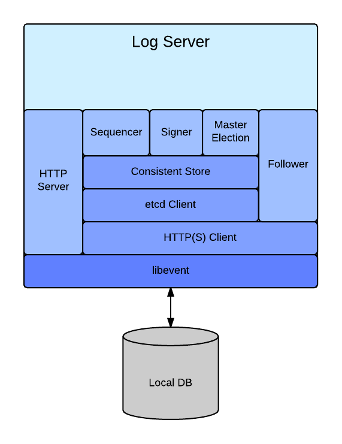

Clustered Log & Mirror Design
=============================
[self-link](https://github.com/google/certificate-transparency/docs/DesignDoc.md)

Objective
---------
A design for a CT Log/Mirror implementation which is resilient, reliable, and
capable of scaling to serve the levels of request traffic that a CT Log would
reasonably expect to receive:
   * multiple tens of thousands of QPS of proof requests (i.e. `get-sth`, 
     `get-consistency-proof`, etc.), 
   * hundreds of QPS of `add-chain` and `add-pre-chain` requests. 

Background
----------
This remainder of this document assumes the reader is familiar with
[RFC6962](https://tools.ietf.org/html/rfc6962) and 
[Certificate Transparency](http://certificate-transparency.org) in general.

The original reference Log implementation was intended to provide an example of
a correct working API, but was not designed to be used in a production
environment. However, since there are various parties interested in running CT
Log (and possibly Mirror) servers, it made sense to provide a reference
implementation which could also serve as a basis for production Logs.

Overview
--------

The design described below describes a distributed, resilient, RFC6962 
compliant CT Log Server which should be productionisable with reasonably 
minimal effort in most modern production environments.

Frontend nodes (FEs) accept (pre-)certificates for integration into the Log,
and create a Signed Certificate Timestamp (SCT) for each valid certificate.
The (pre-)cert+SCT are stored in etcd, and iff the etcd store operation was 
successful is the SCT returned to the client.

All nodes participate in a master election, the winning node is designated the
cluster master and performs various cluster-wide operations, including assigning 
sequence numbers to newly added certificates, and determining the serving STH
for the cluster.

The master node runs a sequencer, this periodically assigns contiguous sequence
numbers to any as-yet unsequenced certificates found in etcd, and writes them
into its local database.

All nodes run a signer thread, this periodically integrates any new certs found
in the local database into the node's in-memory merkle tree, creates a new
node-local STH and announces it to the members of the cluster (note that this
does not make the new STH publicly available.) 
The other nodes in the cluster will shortly become aware of the new STH and, if
it describes a larger tree than they have locally, will request the newly 
integrated certificates from the node which produced the STH, inserting them 
into their own local databases.

Since all nodes run signer threads, in short order all nodes will have 
integrated these new certificates into their in-memory tree and announced their
new tree sizes (via their STHs) to the cluster (note that these STHs are
*still* not yet public.)

The master node takes a view across all of the announced STHs, selects the
newest STH which fulfils the configured serving constraints set by the log
operator (e.g. that a minimum of 75% of nodes are able to serve a given STH),
and publishes that STH as the cluster-wide serving STH (i.e. this STH now
becomes public.) All cluster nodes are informed of this change, and must either
switch to serving this STH, or become transparent proxies, forwarding requests
to other nodes that are able to serve.  Once an out-of-date node catches up
with the rest of the cluster, it automatically switches out of transparent
proxy mode and back to regular serving mode.

### Etcd service
etcd is a highly available, distributed, key-value store accessible via a
JSON/HTTP interface.
Internally, etcd uses an implementation of the Raft consensus algorithm to
ensure a consistent view.

The key-space provided by etcd is broken down into a hierarchical
directory-like structure.

The CT Log implementation uses a number of features which etcd provides, in
particular it relies on:
  * etcd's `index`
  * watches
  * the ability to set an expiry time (TTL) on entries
  * CheckAndSet semantics (i.e. update an entry iff its current index is x)
  * the consistency guarantees etcd offers.

Nodes in the etcd cluster maintain locally stored transaction journals in order
to recover in the event of a crash (journals are periodically checkpointed to
reduce size & replay time.)

For full details of etcd see the
[documentation in the etcd repo](https://github.com/coreos/etcd).

Detailed design
---------------

### Etcd important locations
Some key locations in etcd are reserved for cluster use:

|Path                | Usage |
|--------------------|-------|
|`${ROOT}/entries/`         |Directory of incoming certificates, keyed by their SHA256 hash.|
|`${ROOT}/sequence_mapping` |File containing the mapping of assigned sequence numbers to certificte hash referencing entries in `/entries/`.|
|`${ROOT}/serving_sth`      |File containing the latest published STH (not necessarily the latest produced STH.)|
|`${ROOT}/nodes/`           |Directory holding an entry for each FE which contains the highest fully replicated STH (including leaves) the FE has locally (used to determine which STH the cluster will publicly serving.) Entries under here have a TTL and must be periodically refreshed.|
|`${ROOT}/cluster_config`      |Cluster-wide configuration for the log.|
|`${ROOT}/log_control`      |Control data for the log.|

### Log Server

#### Certificate Flow
##### add-chain / add-pre-chain
When `add-chain`/`add-pre-chain` requests come in to an FE, the FE first checks
its local DB for any identical previously added certificate, and returns the
corresponding SCT if such a cert exists.

If the cert has not previously been logged, the FE creates an SCT for the cert
and stores the cert and its SCT in etcd under the `/entries` directory using
the cert's SHA-256 hash (in base64 encoding) as the key. If this store fails
because an entry already exists for this cert, it retrieves the entry, asserts
that the stored cert matches the request cert, and returns the stored SCT if so.

If the store succeeds the FE will return the newly generated SCT to the client.

etcd will have replicated the entry to a [configurable] number of nodes (which
will all have journaled the transaction inline) before returning OK.

##### Sequencing
The master Sequencer will continuously pull unsequenced certificates from etcd,
assign them sequence numbers, atomically updating the `/sequence_mapping` file
using a `compare-index-and-set` operation. 

The steps are:

1. Gain mastership via etcd.
2. Fetch a local copy of the `/sequence_mapping` file
3. Determine the next available sequence number:
   1. Use the `/sequence_mapping` file to determine the next available sequence
      number, if no entries are present:
   2. retrieve `/serving_sth` and use `tree_size` as the next available
      sequence number. (entries in the `/sequence_mapping` file are only
      removed once they're covered by this STH)
4. Until losing mastership, repeat the following indefinitely:
   1. For each entry in the `/entries` directory older than X minutes (ordered
      by `SCT.timestamp`):
      1. Determine whether there is already an entry for this hash
      2. If no mapping already exists, add mapping entry to local copy of 
         `/sequence_mapping`: `[sequence_number] = [hash]`
      3. increment the next available sequence number
   2. Write `/sequence_mapping` file back to etcd (CheckAndSet)
   3. Write sequenced entries to local DB.

If, somehow, more than one Sequencer is active at any one time, only one of
them will be able to update the `/sequence_mapping` file due to etcd's atomic
CheckAndSet semantics, all other concurrent writes will fail due to being
stale.

##### Signing
All nodes in the cluster will periodically create a new STH with the set of
sequenced entries they have in their local database.  These STHs are pushed
out to etcd in the individual node state files (one file exists for each node)
so that the Master node can select one of these candidate STHs to become the
cluster Serving STH.

The steps are:

1. Gain mastership via etcd.
2. Ensure local DB has caught up with required data for `/serving_sth`
3. Build internal tree specified by STH at `/serving_sth`.  Note:
   1. it's possible that a newer but insufficiently replicated STH exists from
      a previous signer run, but since the cert sequence numbers are determined
      and stable in the `/sequence_mapping` file, any tree we generate has to be
      consistent with it.  
   2. Note that entries in `/sequence_mapping` are only removed if they're
      already covered by the STH at `/serving_sth`
4. Let `expected` = `tree_size` from `/serving_sth`
5. For each entry in `/sequence_mapping`:
   1. if its sequence number is `<` `expected` then check that its hash is the
      same as the entry in the tree, if not `CHECK` fail - gameover.
   2. check that its sequence number `== expected` and append cert to tree
   3. write cert into local DB
   4. increment `expected`
6. Build new STH and update our entry in `/nodes` so other nodes can start to
   replicate data.
   1. Note that the new STH is not yet publicly available, and won't become so
      until some configurable minimum number of nodes have reported that they
      have fully replicated the tree at that STH.

##### Replication
Nodes report both their:
   * current STH
   * local contiguous tree size

in an entry (one per node) under `/nodes`.

Each node watches all other nodes' entries, and, if any other node(s) have
fresher STHs, the watching node will start to fetch entries (in chunks) from
nodes which have them.  Currently, for each chunk of entries, the watching node
will pick a source node at random from the set which it knows has those
entries.  This is to try to spread the load while one or more stale nodes
attempt to catch up. 

At some point after all necessary certs are locally replicated, the local
node's signer will run, integrating all of the replicated entries, and 
generating a new STH which is pushed out to the node's state entry under
`/nodes`. This process continues indefinitely.

Eventually, a sufficient number of nodes will have updated themselves to be at
the new STH.  

The current master signer continuously monitors the entries under `/nodes` and
with each change will calculate the most recent STH that can be served for a
given minimum replication level, and updates `/serving_sth` with this STH.

e.g:

For a 5 node cluster with each node having the following STHs:

|Node |Tree Size|
|:---:|:-------:|
|A|1000|
|B|2000|
|C|2000|
|D|3000|
|E|4000|

Then, depending on the configured minimum number of nodes required to be
serving at any one time, the cluster's public STH would be determined like so:

|Min serving cluster size|Selected STH|
|:----------------------:|:----------:|
|2|3000|
|3|2000|
|4|2000|
|5|1000|

In order to allow all nodes to return the original SCT when a duplicate
certificate is presented to `add-chain`, the nodes support a private extension
to the `get-entries` API which requests that SCTs be included in the response.

##### Cleaning up etcd contents
In order to both protect etcd and maintain performance of the signer/sequencer,
the entries held in etcd in `/sequence_mapping` and `/entries/` need to be
cleaned up periodically.

We know that whatever STH is stored at `/serving_sth` must, by definition, meet
the minimum required replication level, so it's then safe to remove entries
already covered by that STH from both the `/sequence_mapping` file and 
`/entries/` directory.

The flow for deleting entries is:

1. for each entry E in `/sequence_mapping`:
   1. if E's sequence number is `< tree_size` of `/serving_sth`:
      1. remove corresponding cert from `/entries/`
      1. remove entry from `/sequence_mapping`
   2. otherwise, ignore it.

The updates to `/sequence_mapping` happen in one big atomic commit (again,
using etcd's CheckAndSet semantics), and the removal of certificates from
`/entries/` are done in parallel (up-to some configurable amount) to speed
things up.

Since the cluster `add-chain` throughput is effectively limited by the rate at
which certificates can be removed from etcd, the clean-up process will run
again immediately if any work was done in the last run (this ensures that
during very heavy periods of `add-chain` load the cluster keeps up as best it
can.)

#### Local Database
Each Log node in the cluster maintains a local database of entries and serving
STHs (note that this does *not* include locally-generated STH unless they
become promoted to a serving STH.)

Currently there are concrete implementations for:
   * [LevelDB](http://leveldb.org)
   * [SQLite](http://sqlite.org)
   * File-based database.

The LevelDB implementation is the default, and recommended, implementation for
production use.

#### Master Election
The operation of the cluster requires that there is zero or one master node(s)
running at any given time. The transient lack of a running master is fine for
short periods of time (the impact will be that no new STHs can be published,
and the queue of incoming certs can fill up causing the log to stop accepting
more until the queue drains.)

The election is performed as a two-phase process described below.

###### Phase 1:
All nodes wishing to participate in the election create a proposal file in
etcd under the `/election/` directory, and start a watch on the same
directory (in order to be informed of updates to the proposal files.)
These proposal files are created with a short TTL, and will be periodically
refreshed by their corresponding nodes for as long as the node wishes to remain
in the election.

###### Phase 2:
All nodes will update their proposal file in order to "back" (or vote for)
a given proposal, the nodes will always back the proposal file with the 
lowest `create_index` (this is provided by etcd, and in effect provides a 
strictly increasing count of state-modifying operations.)

A node can only consider itself master of the cluster if *all* election proposal
files are backing it.

##### Resiliency to node/master failure
A failure of any participating node will eventually result in that particular
node's proposal file being removed due to its TTL expiring.

Until the failed node's proposal file has expired no change of mastership can
occur (note that if the failed node was *not* the master, this does not imply
that the existing master will lose its mastership.)

##### Etcd Protection
Since etcd is [currently] an in-memory store, there is a limit to the number 
and size of entries which it can safely store.

In order to guard against overloading, nodes monitor the number of entries in
etcd via etcd's stats interface.  Should the sequencer/signer/replication not
be able to keep up with the influx of certificates, the number of entries in
`/entries/` will continue to grow until such time that it hits a configurable
watermark, whereupon the FEs will begin to refuse any further `add-[pre-]chain`
requests. 

Once the number of pending certificates in `/entries/` falls below the
watermark, the FEs will resume accepting requests to `add-[pre-]chain`.

##### Monitoring
A system cannot be production ready without the ability to monitor the health
and actions of it.

The CT Log has an extensible monitoring subsystem which allows the log 
instances to export arbitrarily named counters and gauges. optionally
associating values with a set of typed labels.

For example the HTTP server maintains a counter of HTTP response status codes
labelled by the path the request was for, this might result in a set of values
like so:

| metric name & labels                                          | value |
|---------------------------------------------------------------|-------|
|`http-server-status-by-path{path=/ct/v1/get-sth,status=200}`   | 32453 |
|`http-server-status-by-path{path=/ct/v1/get-sth,status=500}`   |     0 |
|`http-server-status-by-path{path=/ct/v1/add-chain,status=200}` |  2342 |
|`http-server-status-by-path{path=/ct/v1/add-chain,status=400}` |   104 |
|`http-server-status-by-path{path=/ct/v1/add-chain,status=503}` |     4 |

Mechanisms are provided to programmatically gather information about all known
metrics, and there are two concrete implementations of exporters for sending
the collected metrics to external monitoring systems, one is Push based
([Google Cloud Monitoring](https://cloud.google.com/monitoring/)), and the
other Pull based ([Prometheus](http://prometheus.io/).)

It should be relatively easy to add further exporters for most other monitoring
systems.

#### Mirroring
The design also supports running in a `Mirroring` mode, wherein the cluster
will essentially replicate the contents of an external CT compliant Log.

The majority of the operation is identical to that when running as a regular
Log, the differences are outlined below:

1. The `sequencer` described above is replaced with a `target follower` on all
   nodes. This `follower` watches the target CT Log for new STHs and proceeds
   to request all new entries when one is detected.  Once all entries under
   this new STH are stored in a node's local database, it updates its node
   state entry in etcd with this new STH.
   1. Other nodes are then able to retrieve mirrored entries from this node if
      they don't already have them.
   2. The master node performs the same process of selecting an STH out of the
      set of STHs announced by the log nodes for the cluster to serve as when
      running Log mode. 
2. There is no `signer` element.

