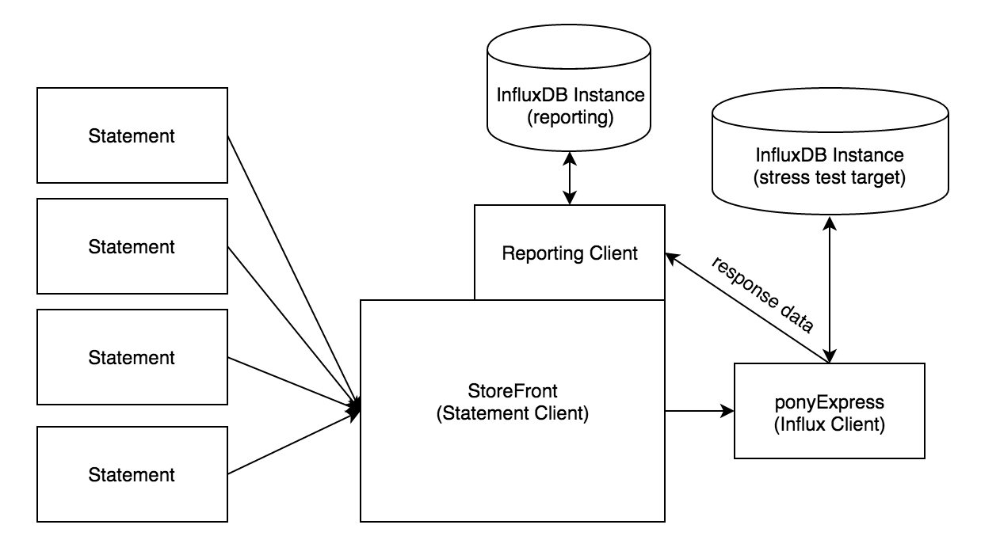

# Influx Stress tool -> `v2`

The design of the new stress tool was designed to:
* have higher potential write throughput than previous version
* have more schema expressibility for testing different load profiles and professional services
* have more granular reporting to be better able to draw conclusions from tests 

In service of these requirements we designed a language that looks a lot like `influxql` to give the new test commands.  Instead of a configuration file, the new stress test takes a list of these `Statements`.  

The tool has the following components:
* Parser - parses the configuration file and turns it into an `[]Statement`. All code related to the parser is in `v2/stressql/`. The parser was designed as per @benbjohnson's great article on [parsers in go](https://blog.gopheracademy.com/advent-2014/parsers-lexers/).
* Statements - perform operations on target instance or change test environment. All code related to statements is in `v2/statement/`. The following are the available statements:
  - `EXEC` - Still a TODO, planned to run outside scripts from the config file.
  - `GO` - Prepend to an `INSERT` or `QUERY` statement to run concurrently.
  - `INFLUXQL` - All valid `influxql` will be passed directly to the targeted instance. Useful for setting up complex downsampling environments or just your testing environment.
  - `INSERT` - Generates points following a template
  - `QUERY` - Runs a given query or generates sample queries given a companion `INSERT` statement
  - `SET` - Changes the test parameters. Defaults are listed in the `README.md`
  - `WAIT` - Required after a `GO` statement. Blocks till all proceeding statements finish.
* Clients - The statement, results and InfluxDB clients. This code lives in `v2/stress_client`
  - `StressTest` - The `Statement` client. Also contains the results client.
  - `stressClient` - A performant InfluxDB client. Makes `GET /query` and `POST /write` requests. Forwards the results to the results client.
  


### Statements

`Statement` is an interface defined in `v2/statement/statement.go`:
```go
type Statement interface {
	Run(s *stressClient.StressTest)
	Report(s *stressClient.StressTest) string
	SetID(s string)
}
```
* `Run` prompts the statement to carry out it's instructions. See the run functions of the various statements listed above for more information. 
* `Report` retrieves and collates all recorded test data from the reporting InfluxDB instance.
* `SetID` gives the statement an ID. Used in the parser. Each `statementID` is an 8 character random string used for reporting.

### `Statement` -> `StressTest`

`Statement`s send `Package`s (queries or writes to the target database) or `Directives` (for changing test state) through the `StressTest` to the `stressClient` where they are processed.
```go
// v2/stress_client/package.go

// T is Query or Write
// StatementID is for reporting
type Package struct {
	T           Type
	Body        []byte
	StatementID string
	Tracer      *Tracer
}

// v2/stress_client/directive.go

// Property is test state variable to change
// Value is the new value
type Directive struct {
	Property string
	Value    string
	Tracer   *Tracer
}
```

The `Tracer` on both of these packages contains a `sync.WaitGroup` that prevents `Statement`s from returning before all their operations are finished. This `WaitGroup` is incremented in the `Run()` of the statement and decremented in `*StressTest.resultsListen()` after results are recorded in the database. This is well documented with inline comments. `Tracer`s also carry optional tags for reporting purposes.

```go
//  v2/stress_client/tracer.go
type Tracer struct {
	Tags map[string]string

	sync.WaitGroup
}
```

### `StressTest`

The `StressTest` is the client for the statements through the `*StressTest.SendPackage()` and `*StressTest.SendDirective()` functions. It also contains some test state and the `ResultsClient`. 

```go
type StressTest struct {
	TestID   string
	TestName string

	Precision string
	StartDate string
	BatchSize int

	sync.WaitGroup
	sync.Mutex

	packageChan   chan<- Package
	directiveChan chan<- Directive

	ResultsChan   chan Response
	communes      map[string]*commune
	ResultsClient influx.Client
}
```

### Reporting Client

The `ResultsClient` turns raw responses from InfluxDB into properly tagged points containing any relevant information for storage in another InfluxDB instance. The code for creating those points lives in `v2/stress_client/reporting.go`

### InfluxDB Instance (reporting)

This is `localhost:8086` by default. The results are currently stored in the `_stressTest` database.

### `stressClient`

An InfluxDB client designed for speed. `stressClient` also holds most test state. 

```go
// v2/stress_client/stress_client.go
type stressClient struct {
	testID string

	// State for the Stress Test
	addresses []string
	precision string
	startDate string
	database  string
	wdelay    string
	qdelay    string

	// Channels from statements
	packageChan   <-chan Package
	directiveChan <-chan Directive

	// Response channel
	responseChan chan<- Response

	// Concurrency utilities
	sync.WaitGroup
	sync.Mutex

	// Concurrency Limit for Writes and Reads
	wconc int
	qconc int

	// Manage Read and Write concurrency separately
	wc *ConcurrencyLimiter
	rc *ConcurrencyLimiter
}
```
Code for handling the write path is in `v2/stress_client/stress_client_write.go` while the query path is in `v2/stress_client/stress_client_query.go`.

### InfluxDB Instance (stress test target)

The InfluxDB which is being put under stress.

### response data

`Response`s carry points from `stressClient` to the `ResultsClient`.

```go
// v2/stress_client/response.go
type Response struct {
	Point  *influx.Point
	Tracer *Tracer
}
```

